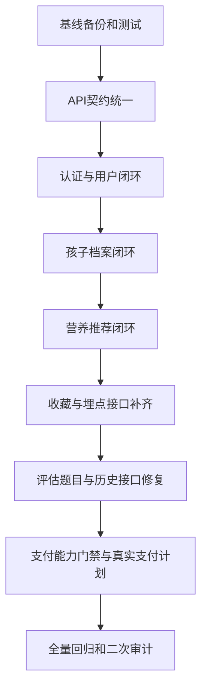

# 小牛育儿AI助理 - 专业修复计划

**制定日期**: 2026-06-08  
**依据文档**: `.monkeycode/CODE_AUDIT_REPORT.md`  
**目标**: 按可备份、可回测、可回滚的方式修复 P0/P1 问题，并降低跨模块回归风险。

---

## 一、执行原则

1. **先基线，后修复**: 每轮修复前确认 `git status --short` 干净，并记录当前 commit。
2. **小批量变更**: 每个修复单元只处理一个闭环能力，例如认证闭环、孩子档案闭环、营养接口闭环。
3. **每步可回滚**: 每个修复单元完成后单独提交 Git；若回测失败，回滚到该单元前的 commit。
4. **先后端契约，后前端适配**: 先定义 API 路由、请求参数、响应结构和错误格式，再调整前端调用。
5. **全局回归门禁**: 单元测试通过只是最低标准，每轮还要核对前端调用路径、认证依赖、数据库结构和关键业务流程。
6. **模拟与真实能力分层**: 审核可用能力先保证闭环；AI、微信支付等外部依赖用清晰的生产配置门禁管理。

---

## 二、全局备份与基线策略

### 2.1 修复前基线

执行前记录:

```bash
git status --short
git log --oneline -5
cd backend && npm test
```

基线产物:
- 当前 commit 号记录到每个阶段的修复日志。
- 当前测试结果记录到阶段报告。
- 当前 `.monkeycode/CODE_AUDIT_REPORT.md` 作为问题来源。

### 2.2 每阶段备份点

每个阶段开始前创建轻量备份分支或 tag，推荐命名:

```bash
git tag repair-baseline-phase-N-YYYYMMDD-HHMM
```

每个修复单元完成后单独 commit:

```bash
git add <本单元修改文件>
git commit -m "fix(scope): 修复说明"
```

### 2.3 回滚条件

出现任一情况即停止并回滚当前单元:
- `cd backend && npm test` 失败。
- 已修复接口导致既有接口响应格式破坏。
- 前端关键页面出现启动级语法错误。
- 数据库迁移导致既有测试数据不可读取。

---

## 三、修复依赖总图



---

## 四、阶段化修复计划

### 阶段0: 基线冻结与接口盘点

**目标**: 建立可回滚起点，确认所有前端调用和后端路由的真实差异。

**修复范围**:
- 只新增审计辅助文档或测试清单。
- 不改业务代码。

**备份点**:
- `repair-baseline-phase-0-YYYYMMDD-HHMM`

**执行步骤**:
1. 记录 `git status --short` 和 `git log --oneline -5`。
2. 运行 `cd backend && npm test`。
3. 用脚本或手动清单核对前端 `app.request` 路径与后端 `app.js` 注册路由。
4. 形成 `API_CONTRACT_CHECKLIST.md`，作为后续修复契约。

**回测项**:
- `cd backend && npm test`
- Git 工作区仅包含预期文档变更。

**通过标准**:
- 基线测试通过。
- API 缺口清单与审计报告一致或更精确。

---

### 阶段1: 认证与用户闭环修复

**覆盖问题**: P0-1、P0-2、P0-3、P0-4、P0-5、P1-13。

**目标**: 完成登录、Token刷新、获取用户信息、账号注销、用户资料更新的最小生产闭环。

**全局影响分析**:
- 认证是孩子档案、会员、支付、邀请、收藏功能的前置能力。
- 先保证 token payload 与既有 `auth.js` 中间件一致，避免会员和支付测试回归。
- 响应结构保持 `success/data/message` 风格，减少前端改动面。

**备份点**:
- `repair-baseline-phase-1-YYYYMMDD-HHMM`

**修复步骤**:
1. 读取 `backend/src/config/database.js` 中 users 表结构，确认字段和索引。
2. 扩展 `backend/src/middleware/auth.js`，明确 `generateToken`、`verifyToken`、`authenticateToken` 的导出契约。
3. 新增 `backend/src/routes/auth.js`，实现:
   - `POST /api/v1/auth/login`
   - `POST /api/v1/auth/refresh`
   - `GET /api/v1/auth/me`
   - `PUT /api/v1/auth/me`
   - `POST /api/v1/auth/account-deletion`
4. 在 `backend/src/app.js` 注册 `/api/v1/auth`。
5. 新增 `backend/tests/auth.test.js`，覆盖登录、刷新、获取信息、注销。
6. 检查 `miniprogram/app.js` 的登录响应字段，必要时做最小适配。
7. 增加部署文档片段，说明 `JWT_SECRET` 必须配置。

**回测项**:
```bash
cd backend && npm test
```

**手动回测清单**:
- 小程序启动后可完成登录。
- 个人中心可读取用户信息。
- Token过期模拟后可刷新。
- 账号注销接口返回成功且相关用户数据不可继续访问。

**通过标准**:
- 后端测试通过。
- 既有 membership 测试无回归。
- 登录相关前端调用路径全部有后端实现。

**回滚条件**:
- 会员测试因 token payload 改动失败。
- 登录接口返回字段与前端无法兼容。

---

### 阶段2: 孩子档案闭环修复

**覆盖问题**: P0-6、P1-7、P1-14、P2-4。

**目标**: 后端补齐孩子档案 CRUD，前端档案页面和依赖孩子信息的功能可使用统一数据源。

**全局影响分析**:
- 孩子档案被评估、营养、教材、阅读任务共同依赖。
- 修复时保留前端本地缓存作为离线/降级读缓存，但服务器数据为权威来源。

**备份点**:
- `repair-baseline-phase-2-YYYYMMDD-HHMM`

**修复步骤**:
1. 确认 children 表字段和 user_id 约束。
2. 新增 `backend/src/routes/children.js`，实现:
   - `GET /api/v1/children`
   - `POST /api/v1/children`
   - `GET /api/v1/children/:id`
   - `PUT /api/v1/children/:id`
   - `DELETE /api/v1/children/:id`
3. 所有 children 接口强制认证并校验 user_id 所属关系。
4. 在 `backend/src/app.js` 注册 `/api/v1/children`。
5. 新增 `backend/tests/children.test.js`。
6. 审查 `miniprogram/pages/profile/children/children.js`、`child-edit.js`、`utils/child-profile.js` 的数据字段映射。
7. 保持本地缓存字段与后端字段一致，避免教材和营养页面读取失败。

**回测项**:
```bash
cd backend && npm test
```

**手动回测清单**:
- 新增孩子档案。
- 编辑孩子档案。
- 删除孩子档案。
- 教材页面读取当前孩子信息。
- 营养页面读取当前孩子年龄。

**通过标准**:
- children 测试通过。
- 教材、营养、评估入口均可读取同一孩子数据。

**回滚条件**:
- 前端已有本地孩子档案无法迁移或展示异常。
- 删除接口误删其他用户数据。

---

### 阶段3: 营养模块闭环修复

**覆盖问题**: P0-7、P1-2、P1-5、P2-13。

**目标**: 补齐营养推荐、食谱列表、详情、收藏接口，让前端营养页面从后端获取真实结构化数据。

**全局影响分析**:
- 营养推荐依赖孩子年龄、过敏信息和会员状态。
- 先实现无外部依赖的规则推荐，确保审核可演示；后续可替换算法。

**备份点**:
- `repair-baseline-phase-3-YYYYMMDD-HHMM`

**修复步骤**:
1. 确认现有 nutrition 相关表或种子数据。
2. 新增或完善 `backend/src/routes/nutrition.js`:
   - `GET /api/v1/nutrition/recommendations`
   - `GET /api/v1/nutrition/recipes`
   - `GET /api/v1/nutrition/recipes/:id`
   - `POST /api/v1/nutrition/recipes/:id/favorite`
3. 收藏接口复用统一收藏表或独立 recipe_favorites 表，避免与文章收藏冲突。
4. 注册路由并新增 `backend/tests/nutrition.test.js`。
5. 审查 `nutrition.js`、`recipe-list.js`、`recipe-detail.js` 的字段匹配。
6. 补齐空数据状态和错误提示。

**回测项**:
```bash
cd backend && npm test
```

**手动回测清单**:
- 打开营养首页可看到推荐食谱。
- 点击食谱可进入详情页。
- 收藏/取消收藏可成功。
- 无孩子档案时展示友好提示。

**通过标准**:
- 营养模块接口与前端调用 100% 匹配。
- 空数据、未登录、无孩子档案均有明确处理。

---

### 阶段4: 育儿文章收藏与知识库埋点修复

**覆盖问题**: P0-8、P1-1、P1-6、P2-7、P2-13。

**目标**: 补齐文章收藏，修正知识库埋点路径，确保内容浏览和行为数据闭环。

**全局影响分析**:
- 收藏依赖认证，必须在阶段1后执行。
- 埋点失败不能阻断用户主流程，接口应降级为异步容错。

**备份点**:
- `repair-baseline-phase-4-YYYYMMDD-HHMM`

**修复步骤**:
1. 在 `backend/src/routes/parenting.js` 添加文章收藏/取消收藏接口。
2. 验证 `article-detail.js` 的详情路径与返回字段。
3. 统一 `/kb/events/track` 和 `/kb/events`，优先后端兼容前端已有路径，降低前端改动。
4. 增加对应测试。
5. 前端收藏状态根据后端返回更新，失败时恢复原状态。

**回测项**:
```bash
cd backend && npm test
```

**手动回测清单**:
- 育儿文章列表可进入详情。
- 收藏按钮可切换状态。
- 埋点请求失败时页面功能继续可用。

---

### 阶段5: 评估接口与结果保存稳定化

**覆盖问题**: P1-3、P1-9、P2-3、P2-12。

**目标**: 修复评估历史数量接口、题目数量不一致和结果保存逻辑复杂的问题。

**全局影响分析**:
- 评估结果影响个人档案、成长建议和会员价值展示。
- 优先保证现有题目可完整保存，再逐步接入动态题库。

**备份点**:
- `repair-baseline-phase-5-YYYYMMDD-HHMM`

**修复步骤**:
1. 添加 `GET /api/v1/assessments/history/count`。
2. 明确题目来源: 当前阶段使用数据库种子或完整静态题库导入，避免只返回2题。
3. 简化 `assessment/do/do.js` 提交流程，只保留明确的成功、失败、离线缓存三条路径。
4. 增加评估接口测试，覆盖题目列表、提交结果、历史数量。
5. 验证结果页读取字段。

**回测项**:
```bash
cd backend && npm test
```

**手动回测清单**:
- 选择评估维度。
- 完成整套题目。
- 提交结果。
- 查看历史记录和结果详情。

---

### 阶段6: 支付能力门禁与订阅闭环

**覆盖问题**: P1-4、P1-8、会员订阅流程部分缺失。

**目标**: 明确审核演示状态和真实支付状态，避免启用支付入口但后端仍是模拟支付导致审核或生产风险。

**全局影响分析**:
- 支付是高风险链路，涉及微信商户号、回调验签、订单状态、会员激活。
- 未接入真实支付前，前端支付入口应显示“支付配置中”或走兑换码/试用路径；真实支付启用必须绑定商户配置门禁。

**备份点**:
- `repair-baseline-phase-6-YYYYMMDD-HHMM`

**修复步骤**:
1. 审查 `backend/src/routes/payment.js` 与 `backend/src/services/payment.js` 的真实能力边界。
2. 增加配置校验: `WECHAT_PAY_MCH_ID`、`WECHAT_PAY_API_KEY`、证书路径、回调URL。
3. 将 `enablePayment` 拆分为 `showMembership` 与 `enableWechatPay`，避免会员页展示与真实支付混淆。
4. 未配置真实支付时，创建订单接口返回明确业务错误，不创建假成功订单。
5. 增加订单创建、配置缺失、回调验签的测试。
6. 若商户资料齐全，再接入微信支付SDK；若资料暂缺，保留会员试用和兑换码能力。

**回测项**:
```bash
cd backend && npm test
```

**手动回测清单**:
- 未配置真实支付时，点击购买给出明确提示。
- 兑换码和试用不受影响。
- 真实配置齐全时，订单创建进入微信支付流程。

**通过标准**:
- 支付入口行为与实际后端能力一致。
- 不出现“前端显示可支付，后端模拟成功”的状态。

---

### 阶段7: AI聊天与知识库能力稳定化

**覆盖问题**: P2-2、P2-10、育儿建议流程部分模拟。

**目标**: 明确真实AI配置门禁，并让模拟降级和真实AI调用可控切换。

**全局影响分析**:
- AI服务外部依赖可能超时或失败，必须设计降级，不影响基础内容功能。

**备份点**:
- `repair-baseline-phase-7-YYYYMMDD-HHMM`

**修复步骤**:
1. 新增 `backend/src/services/ai.js`，封装真实AI调用和超时控制。
2. 增加 `AI_PROVIDER`、`AI_API_KEY`、`AI_TIMEOUT_MS` 配置。
3. chat 路由改为优先真实AI，失败时使用知识库摘要降级。
4. 增加AI服务mock测试，避免测试依赖外网。
5. 检查前端聊天错误提示和重试逻辑。

**回测项**:
```bash
cd backend && npm test
```

**手动回测清单**:
- 正常提问返回育儿建议。
- AI超时返回降级提示和知识库建议。
- 聊天历史保存正常。

---

### 阶段8: 全量回归、二次审计和审核包生成

**目标**: 确认所有 P0/P1 问题清零，重新生成审批报告和小程序包。

**备份点**:
- `repair-baseline-phase-8-YYYYMMDD-HHMM`

**回测命令**:
```bash
cd backend && npm test
npm audit --prefix backend
git status --short
```

**全局回归清单**:
- 登录与token刷新。
- 个人中心与账号注销。
- 孩子档案新增、编辑、删除。
- 评估题目、提交、历史、结果页。
- 营养推荐、详情、收藏。
- 育儿文章列表、详情、收藏。
- 教材任务、完成状态。
- 会员信息、试用、兑换码、支付门禁。
- 邀请码生成、复制或分享。
- 隐私政策、用户协议、账号注销页面可访问。

**产物**:
- `.monkeycode/POST_REPAIR_AUDIT_REPORT.md`
- `.monkeycode/API_CONTRACT_CHECKLIST.md`
- 最新小程序打包文件。
- Git 提交记录。

**通过标准**:
- P0问题为0。
- P1问题全部修复或有明确可接受的产品决策记录。
- 后端测试全部通过。
- 前后端接口匹配率达到100%。
- 支付入口与真实能力一致。

---

## 五、测试策略

### 5.1 单元和接口测试

每个新增路由必须新增测试:
- 认证: `auth.test.js`
- 孩子档案: `children.test.js`
- 营养: `nutrition.test.js`
- 收藏/埋点: `content.test.js` 或合并到现有测试
- 评估: 扩展 `api.test.js`
- 支付: 扩展 `membership.test.js` 或新增 `payment.test.js`

### 5.2 契约测试

维护一份接口契约表，字段包括:
- 前端调用路径
- 后端路由
- method
- 请求参数
- 响应字段
- 是否需要认证
- 对应测试文件

### 5.3 回归测试

每阶段最少执行:

```bash
cd backend && npm test
```

涉及依赖变更时额外执行:

```bash
npm audit --prefix backend
```

### 5.4 手动验收

使用微信开发者工具逐页验收，记录页面、账号、操作步骤、预期结果和实际结果。

---

## 六、风险控制

| 风险 | 控制方式 |
|------|----------|
| 修复认证导致会员接口回归 | 保持 JWT payload 兼容，并先跑 membership 测试 |
| 数据库字段不匹配 | 先读表结构，再写路由和测试 |
| 前端字段映射错误 | API 契约先行，前端只做最小适配 |
| 支付假成功 | 拆分展示开关和真实支付开关，配置不足直接返回业务错误 |
| AI外部服务不稳定 | 真实AI与降级回答分层，测试使用mock |
| 修复范围膨胀 | 每阶段只修复列明问题，P2/P3进入后续优化 |

---

## 七、建议执行顺序

1. 阶段0: 基线冻结与接口盘点。
2. 阶段1: 认证与用户闭环。
3. 阶段2: 孩子档案闭环。
4. 阶段3: 营养模块闭环。
5. 阶段4: 育儿文章收藏与知识库埋点。
6. 阶段5: 评估接口与结果保存稳定化。
7. 阶段6: 支付能力门禁与订阅闭环。
8. 阶段7: AI聊天与知识库能力稳定化。
9. 阶段8: 全量回归、二次审计和审核包生成。

---

## 八、当前建议

当前先执行阶段0和阶段1。认证闭环修复完成并测试通过后，再进入孩子档案与营养模块，避免在无用户身份基础上修复下游功能导致重复返工。
