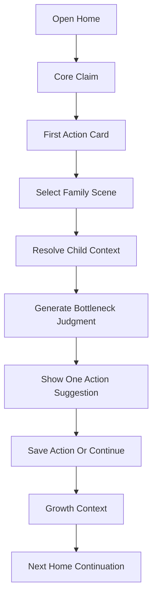

# 小程序核心重构技术设计

Feature Name: miniprogram-core-refactor
Updated: 2026-07-10

## Description

本设计将小程序从“功能集合首页”重构为“场景判断到行动建议”的主链路。首页首屏只突出核心主张和第一动作，已有测评、AI 问答、育儿知识、营养食谱、能力练习、成长记录作为支撑工具进入分层展示。

核心路径为：用户选择家庭场景和孩子年龄，系统给出卡点判断和今晚第一步，用户保存或记录执行意向，后续首页承接继续行动和成长记录。

## Architecture



首页不再把功能板块作为用户决策中心，而是把功能板块作为结果后的支撑工具。用户先回答“孩子现在发生了什么”，系统再分发到测评、知识、AI 问答、练习或记录。

## Components And Interfaces

### Home Page: `miniprogram/pages/index`

职责调整：

- 展示核心主张、第一动作入口和继续行动入口。
- 将现有 `featureFlags` 下的功能板块收敛为低优先级 supporting tools。
- 优先根据 `continueTask`、`retentionSummary`、`currentChild` 和本地记录决定首页主卡片。

建议新增数据结构：

```javascript
coreRefactorState: {
  claim: '先看懂孩子当前卡点，再做今晚第一步',
  primaryActionText: '看看孩子现在卡在哪',
  activeScene: '',
  currentBottleneck: null,
  nextAction: null
}
```

### First Action Flow

可先以内嵌首页模块实现，后续独立页面化。

职责：

- 展示家庭场景选项。
- 补齐年龄或孩子档案。
- 调用现有 AI 或内容推荐能力生成判断。
- 生成行动卡片。

首批场景建议：

- 写作业或专注
- 亲子共读或阅读
- 吃饭
- 睡前洗漱
- 情绪崩溃
- 出门上课或入园

### Existing AI Chat

职责调整：

- 从开放问答入口调整为第一动作后的深挖工具。
- 保留 tab 入口，但首页文案强调“追问细节”。
- 回答后继续提供保存、生成计划和下一步按钮。

### Growth Record

职责调整：

- 承接第一动作结果。
- 保存场景、判断、行动建议、执行状态和用户反馈。
- 为首页继续行动提供数据来源。

### Content Modules

职责调整：

- 育儿知识、营养、能力练习按场景结果推荐。
- 首页直接并列入口降级为“更多工具”。
- 继续保留独立页面，降低首屏认知负担。

## Data Models

### First Action Result

```javascript
{
  id: 'local-or-server-id',
  childId: 0,
  ageGroup: '3-6',
  sceneKey: 'homework_start_resistance',
  sceneLabel: '写作业坐不住',
  bottleneckTitle: '先判断是听不懂、太难，还是启动困难',
  actionTitle: '今晚先做 3 分钟开头陪跑',
  actionSteps: [
    '先把第一题读给孩子听',
    '只要求孩子说出题目要做什么',
    '完成第一步后再进入正式练习'
  ],
  sourceType: 'scene_recommendation',
  createdAt: 0,
  saved: false,
  completed: false
}
```

### Home Priority Decision

```javascript
{
  primaryCardType: 'continue_action | first_action | weekly_summary | profile_completion',
  reason: 'unfinished_action | no_context | recent_record | missing_profile',
  targetPath: '',
  targetPayload: {}
}
```

## Correctness Properties

- 首页首屏只展示一个主 CTA。
- 第一动作结果必须包含场景、年龄上下文、卡点判断和行动建议。
- 功能板块在首页的优先级低于继续行动和第一动作。
- 用户缺少孩子年龄时，推荐结果应明确引导补齐年龄。
- 保存后的行动结果应能被首页读取并形成继续行动卡片。

## Error Handling

- 当 AI 或后端推荐失败时，使用本地高频场景兜底建议。
- 当孩子档案缺失时，展示轻量补档入口并允许用户先选择年龄段。
- 当成长记录保存失败时，保留本地临时结果并提示稍后同步。
- 当运行时配置关闭 AI 问答时，第一动作继续使用结构化内容推荐。

## Test Strategy

- 执行 `npm run lint` 验证小程序和后端语法。
- 为首页优先级决策补充脚本测试，覆盖未登录、无档案、有未完成行动、有最近记录、会员状态等输入。
- 为第一动作结果生成补充脚本测试，覆盖场景缺失、年龄缺失、推荐失败和保存成功。
- 手工检查首页首屏：核心主张、一个主 CTA、功能板块下沉。

## Implementation Plan

1. 重写首页信息架构：核心主张、第一动作、继续行动、更多工具。
2. 新增或复用首页内第一动作场景选择模块。
3. 增加本地 first action result 存储和首页继续行动读取。
4. 接入现有内容推荐或 AI 问答，先用本地高频场景兜底。
5. 将原功能板块收敛为 supporting tools。
6. 增加埋点字段和回测脚本。

## References

[^1]: `.monkeycode/specs/2026-06-27-miniprogram-next-iteration/requirements.md` - 小程序留存提升迭代需求
[^2]: `.monkeycode/specs/2026-06-27-miniprogram-next-iteration/design.md` - 小程序留存提升技术设计
[^3]: `.monkeycode/docs/miniprogram-30day-marketing-plan.md` - 对外统一心智与推广口径
[^4]: `.monkeycode/docs/high-frequency-scene-density-audit-2026-06-19.md` - 高频家庭场景内容密度审计
