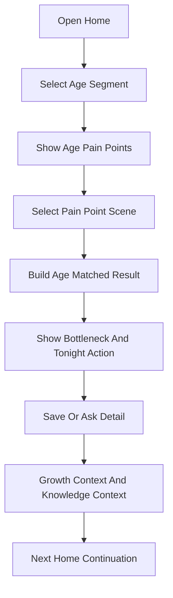

# 年龄优先核心重构技术设计

Feature Name: age-first-core-refactor
Updated: 2026-07-12

## Description

本设计在当前“小程序核心重构”基础上继续演进。当前首页已具备核心主张、场景选择、年龄选择、表现选择、卡点判断、今晚第一步、保存任务、次日记录和后台漏斗。本轮将首页第一步调整为年龄段选择，并按年龄段动态展示家长痛点场景。

核心路径为：用户选择年龄段，首页展示该年龄段的重点发展任务和家长痛点，用户选择痛点场景，系统生成年龄匹配的卡点判断和今晚第一步，后续承接 AI 追问、知识库推荐、成长记录、连续计划和周总结。

## Architecture



## Components And Interfaces

### Age Segment Configuration

修改 `miniprogram/utils/core-action-scenes.js`，将现有场景配置扩展为年龄段优先配置。

建议结构：

```javascript
{
  key: 'age_2_3',
  label: '2-3岁',
  title: '先建立大运动和表达基础',
  focusAreas: ['大运动模式', '语言表达', '安全感', '模仿能力'],
  parentPainPoints: [
    {
      key: 'gross_motor_unstable',
      title: '走跑跳总是不稳',
      observableSigns: ['容易摔', '不敢跳', '上下台阶害怕'],
      abilityTags: ['大运动', '前庭觉', '本体觉'],
      sceneKey: 'gross_motor_foundation'
    }
  ]
}
```

### Home Page State Machine

修改 `miniprogram/pages/index/index.js` 和 `index.wxml`，将当前 `scene_select -> age_select -> symptom_select` 调整为 `age_select -> pain_point_select -> symptom_select/result`。

状态建议：

```javascript
coreRefactorState: {
  stage: 'age_select | pain_point_select | symptom_select | bottleneck_result | effect_record | effect_recorded',
  selectedAgeSegment: null,
  selectedPainPoint: null,
  selectedSymptomKey: '',
  currentBottleneck: null,
  nextAction: null
}
```

### First Action Result

扩展第一动作结果，保留兼容字段并新增年龄段和能力维度字段。

```javascript
{
  ageSegmentKey: 'age_4_5',
  ageSegmentLabel: '4-5岁',
  focusAreas: ['专注力', '身体控制'],
  painPointKey: 'short_attention_play',
  painPointTitle: '玩什么都坚持不了多久',
  abilityTags: ['持续专注', '身体控制'],
  sceneKey: 'focus_foundation',
  bottleneckTitle: '先判断是身体坐不住，还是任务太长',
  actionTitle: '今晚只做 3 分钟轮流小游戏',
  actionSteps: []
}
```

### Knowledge And AI Context

修改 AI 追问上下文和后端知识库召回参数。小程序从首页进入聊天时传递 `ageSegmentKey`、`painPointKey`、`abilityTags`、`observableSigns`、`actionSteps`。后端聊天链路在现有 `collectChatReferences()` 基础上增强年龄段和能力标签匹配。

### Analytics

扩展 `trackCoreActionEvent()` 事件元数据，新增 `age_segment_key`、`pain_point_key`、`ability_tags`。后台核心行动漏斗在现有事件聚合基础上增加年龄段和能力维度聚合。

## Data Models

### Age Segment

```javascript
{
  key: 'age_2_3',
  label: '2-3岁',
  title: '',
  subtitle: '',
  focusAreas: [],
  parentSummary: '',
  painPoints: []
}
```

### Parent Pain Point

```javascript
{
  key: '',
  title: '',
  description: '',
  observableSigns: [],
  abilityTags: [],
  sceneKey: '',
  symptoms: [],
  defaultBottleneck: {},
  nextActions: {}
}
```

## Correctness Properties

- P1: 每个合法年龄段必须至少包含 5 个家长痛点场景。
- P2: 每个家长痛点场景必须包含标题、可观察表现、背后能力、场景 key 和默认第一动作。
- P3: 任意合法年龄段和痛点场景组合都必须生成包含年龄段、痛点、能力标签、卡点判断和行动步骤的结果。
- P4: 2-3岁、3-4岁、4-5岁、5-6岁痛点场景中不得出现中考体训、专项强化等高龄表达。
- P5: 8-9岁、9-12岁痛点场景必须覆盖学习能力支持或体测准备相关入口。
- P6: 首页任意阶段渲染时必须保留一个明确主 CTA 和一个可返回年龄选择的入口。
- P7: 埋点事件在年龄优先链路中必须携带年龄段 key，场景选择之后必须携带痛点 key 和能力标签。

## Error Handling

- 当用户没有孩子档案时，首页使用默认年龄段并提供切换入口。
- 当年龄段配置缺失时，首页回退到 4-5岁或当前核心重构旧场景列表。
- 当某个痛点场景缺少专属动作时，使用同年龄段同能力标签的默认动作。
- 当 AI 或知识库召回失败时，结果页继续展示本地结构化第一动作。
- 当年龄优先功能开关关闭时，首页回退到当前已上线的核心重构链路。

## Test Strategy

- 执行 `npm run lint` 验证小程序和后端语法。
- 执行 `npm test` 验证现有核心链路回归。
- 扩展 `scripts/test-core-action-scenes.js`，覆盖年龄段配置完整性和低龄/高龄表达边界。
- 扩展 `scripts/test-home-core-flow.js`，覆盖年龄选择、痛点选择、结果生成和保存闭环。
- 扩展 `scripts/test-admin-core-action-analytics.js`，覆盖年龄段和能力维度埋点聚合。

## References

- `.monkeycode/specs/2026-07-10-miniprogram-core-refactor/requirements.md` - 当前核心重构需求
- `.monkeycode/specs/2026-07-10-miniprogram-core-refactor/design.md` - 当前核心重构技术设计
- `miniprogram/utils/core-action-scenes.js` - 当前核心场景配置
- `miniprogram/pages/index/index.js` - 当前首页核心链路
- `backend/src/mysql-production/core-action-analytics.js` - 当前核心行动后台统计
