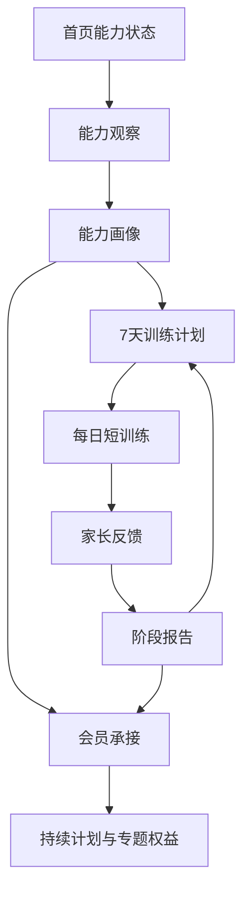

# 3-6 岁儿童发展能力会员优化设计

Feature Name: child-development-membership
Updated: 2026-08-21

## Description

本设计复用现有首页核心观察、每日计划、成长记录、周总结、会员触点和 3-6 岁发展专区能力，将多个平行育儿入口收敛为一条“观察 → 计划 → 训练 → 记录 → 报告 → 会员”的服务链。

首期主入口为“专注力与感觉运动能力观察”。身高管理和儿童身体安全教育以会员专题方式接入，形成后续扩展能力。

## Architecture

### 页面信息架构

- 首页：当前能力状态、今日训练、报告摘要、发展专题。
- 训练：今日计划、训练日历、专项训练、家长陪练说明。
- 报告：能力画像、周报告、阶段变化、历史复测。
- 我的：孩子档案、会员权益、邀请分享、隐私设置。

### 现有能力复用

- `coreRefactorState` 复用观察流程状态，增加能力领域和评估版本。
- `dailyPlanCards` 复用每日计划展示，补充训练目标、动作步骤和家长话术。
- `growth-record` 复用成长记录页面，增加训练来源、能力领域和家长反馈。
- `weekly-summary` 复用周总结页面，增加能力趋势和下一阶段建议。
- `membership` 复用会员页，调整权益文案和来源参数。
- `development-zones` 复用 3-6 岁发展专区数据结构，先突出专注力和感觉运动。

### 后台分层

- 维度层：统一年龄段、能力方向、场景和内容形态代码。
- 内容层：扩展正式知识库字段、导入校验和统一召回入口。
- 业务层：提供能力观察、训练计划、统一成长条目、阶段报告和会员状态服务。
- 分析层：扩展事件协议、日聚合任务、分析 API 和运营后台页面。
- 兼容层：保留当前线上字段的受控映射，统计旧字段使用并逐步收口。

## Components and Interfaces

### 首页组件

1. `AbilityStatusCard`：展示孩子档案、当前能力方向、本周完成进度。
2. `PrimaryActionCard`：根据状态展示能力观察、继续训练或查看报告。
3. `TodayTrainingCard`：展示当天训练任务和完成状态。
4. `ReportPreviewCard`：展示阶段变化摘要和报告入口。
5. `DevelopmentTopicGrid`：展示专注力、感觉运动、生长管理和身体安全专题。
6. `MembershipTouchpoint`：根据观察结果、训练完成和报告状态展示会员权益。

### 事件接口

统一沿用现有事件追踪入口，新增以下事件名：

- `ability_observation_exposure`
- `ability_observation_start`
- `ability_observation_complete`
- `ability_profile_view`
- `training_plan_generate`
- `training_task_view`
- `training_task_complete`
- `training_feedback_submit`
- `stage_report_view`
- `stage_report_share`
- `membership_touchpoint_exposure`
- `membership_touchpoint_click`

事件公共字段：`event_id`、`client_session_id`、`action_id`、`child_id`、`age_segment_code`、`ability_codes`、`plan_id`、`source_module`、`source_page`、`source_content_type`、`source_content_id`、`membership_status`、`membership_entry_source`、`occurred_at`、`schema_version`。

### API 分组

- 孩子档案：复用当前孩子列表、编辑和当前孩子接口，统一归属校验。
- 能力观察：扩展当前测评接口，提供观察列表、题目、提交、画像和历史记录。
- 训练计划：扩展当前 `daily-plan` 接口，增加计划、任务、完成、反馈和下一步建议。
- 成长时间线：扩展当前 `growth-records` 接口，统一承接测评、训练、专区、AI 和核心行动。
- 阶段报告：扩展当前 `weekly-summary` 接口，支持历史报告和服务端会员字段裁剪。
- 会员状态：以 `membership/info` 为唯一权益事实来源，留存接口只提供召回建议。
- 发展专区：以服务端正式内容优先，小程序本地数据作为降级内容。
- 分析接口：增加年龄、能力、成长闭环、会员归因、事件质量和内容覆盖接口。

所有孩子相关 API 在读写前校验 `childId` 属于当前用户。所有写接口接收幂等标识并返回稳定业务 ID。

### 知识库设计

知识内容统一保留以下维度：

- `age_segment_codes`
- `ability_codes`
- `scene_codes`
- `content_form`
- `training_objective`
- `duration_minutes`
- `steps`
- `parent_prompt`
- `observe_signals`
- `safety_notice`
- `source_name`
- `source_url`
- `evidence_level`
- `content_version`
- `review_status`

知识导入继续采用 JSON 数组和幂等更新。AI 问答、训练推荐和专区内容通过统一聚合召回入口读取正式库，并按年龄、能力、发布状态和审核状态筛选。本地种子只承担初始化和接口失败降级。

## Data Models

### AbilityProfile

- `childId`
- `ageSegment`
- `assessmentVersion`
- `abilityDomain`
- `dimensionScores`
- `observableSigns`
- `primaryFocus`
- `createdAt`

### TrainingPlan

- `planId`
- `childId`
- `abilityProfileId`
- `durationDays`
- `tasks`
- `status`
- `startDate`
- `endDate`

### TrainingFeedback

- `taskId`
- `childId`
- `status`
- `feedbackKey`
- `note`
- `createdAt`

### StageReport

- `reportId`
- `childId`
- `periodStart`
- `periodEnd`
- `completedTaskCount`
- `feedbackSummary`
- `abilityTrend`
- `nextSuggestions`
- `premiumUnlocked`

### GrowthTimelineEntry

- `entryId`
- `childId`
- `entryType`
- `sourceType`
- `sourceId`
- `abilityCodes`
- `occurredAt`
- `title`
- `summary`
- `dimensions`
- `metadata`

### KnowledgeContentMetadata

- `contentType`
- `contentId`
- `ageSegmentCodes`
- `abilityCodes`
- `sceneCodes`
- `contentForm`
- `sourceName`
- `evidenceLevel`
- `contentVersion`
- `reviewStatus`

## Correctness Properties

- 首页首要行动与孩子当前服务状态保持一致。
- 每个训练任务只对应一个孩子、一个计划和一个能力方向。
- 报告中的训练次数来自可追溯的训练记录。
- 缺少孩子生日时，系统使用用户选择的年龄段并标记档案待完善。
- 能力画像文案使用观察和支持表达，健康相关专题提供专业边界提示。
- 远程数据失败时，首页仍能展示本地缓存的孩子档案和训练入口。
- 同一用户的多个孩子之间不存在观察、计划、记录和报告串用。
- 同一幂等标识的重复写入只产生一条业务记录。
- 阶段报告中的会员字段由服务端按会员状态裁剪。
- 正式知识内容只使用标准年龄和能力代码进入推荐与 AI 召回。
- 埋点会话字段只保存客户端会话标识，不保存认证凭据。

## Error Handling

- 观察提交失败：保留已选择答案，提供重试入口。
- 计划生成失败：展示适龄示范训练，并允许稍后重新生成。
- 训练记录失败：先保存本地待同步记录，展示同步状态。
- 报告数据不足：展示已有记录和补充记录入口。
- 会员状态未知：展示基础体验内容，避免误显示完整会员权益。
- 专题内容缺失：展示年龄段说明和返回发展专区入口。

## Test Strategy

- 首页状态测试：未登录、无档案、已有观察、存在未完成计划、会员到期。
- 能力观察测试：年龄选择、表现选择、完成结果、重复提交和远程失败。
- 训练闭环测试：计划生成、任务完成、反馈提交、次日承接和本地恢复。
- 报告测试：无数据、部分数据、完整周期和会员权限展示。
- 事件测试：所有新增事件包含公共字段且来源参数正确。
- 数据隔离测试：切换孩子后，观察进度、训练、成长时间线和报告保持独立。
- 幂等属性测试：任意重复完成请求只生成一条完成记录。
- 报告属性测试：报告训练数量等于可追溯时间线中符合周期条件的完成记录数。
- 知识属性测试：任意进入正式召回的内容都具有合法年龄、能力和审核状态。
- 会员裁剪测试：基础用户响应不包含完整趋势、重点建议和会员专属内容。
- 分析测试：事件漏斗、用户漏斗、会员归因和日聚合在固定样本下结果稳定。
- 回归测试：`npm run lint`、`npm test`、现有首页核心流程脚本和小程序结构脚本。
