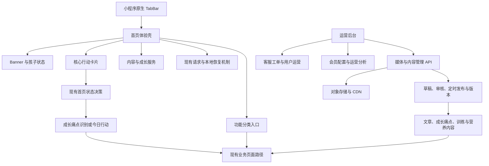
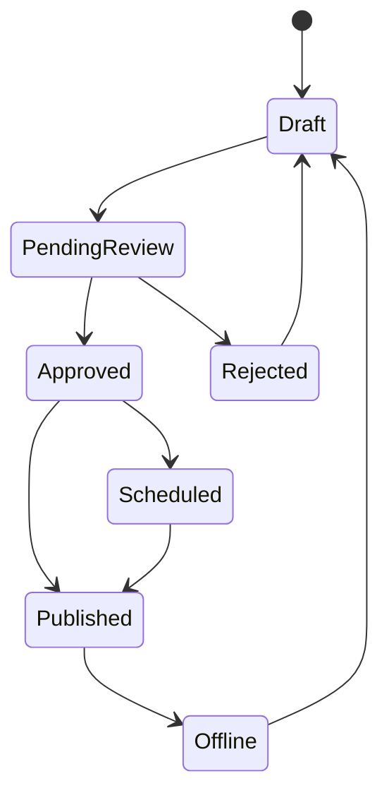

# 小牛育儿小程序体验焕新重构

Feature Name: miniprogram-experience-refactor
Updated: 2026-09-02

## 描述

本方案以首页和功能页为视觉及信息架构样板，并将现有只读数据后台扩展为完整运营平台。小程序采用传统单列纵向结构：顶部 Banner、功能分类入口、今日核心行动、内容推荐和成长服务。新版通过公共样式变量和可复用入口组件统一页面表现；登录、孩子档案、支付、会员权益、成长记录和报告继续调用现有业务接口。文章、成长痛点、训练和营养内容逐步迁移为服务端可运营内容。

## 架构



### 分层职责

- **页面层**：负责首页分区顺序、页面事件和状态展示。
- **视觉层**：负责颜色、字号、间距、圆角、阴影和图标尺寸。
- **入口配置层**：负责功能板块标题、副标题、图标和目标页面映射。
- **业务状态层**：继续使用现有首页主动作、孩子档案、会员状态和本地快照逻辑。
- **接口层**：继续使用现有请求封装、登录刷新和错误消息映射。
- **运营管理层**：负责内容、媒体、用户运营、会员配置和客服工单管理。
- **发布工作流层**：负责草稿、审核、定时发布、下线、版本恢复和缓存刷新。
- **审计权限层**：负责管理员角色、字段权限和所有写操作的审计记录。

## 页面与组件

### 首页

首页按以下顺序组织：

1. 顶部 Banner：品牌标题、当前孩子、简短价值说明和一个主入口。
2. 快捷入口：四个常用入口，以图标加标题展示。
3. 今日行动：展示当前主动作、原因和按钮。
4. 按场景浏览：写作业、出门、睡前、亲子共读等家庭场景。
5. 成长服务：成长记录、阶段报告、会员服务。

### 功能页

功能页采用三级信息层级：

1. 一级菜单：底部 TabBar 的“功能”。
2. 二级菜单：功能页内的“做事与学习、情绪与配合、说话与表达、同伴与相处、身体与适应”五组分类。
3. 三级入口：分类下的具体成长痛点，入口标题控制在 2 至 6 个字，完整情境放在副标题或详情页中。

三级成长痛点入口示例：

- 叫了不动
- 做着分心
- 换活动就哭
- 说话不清
- 故事讲不出
- 坐不住
- 不会一起玩
- 陌生地方紧张

成长痛点入口可以按“做事与学习、情绪与配合、说话与表达、同伴与相处、身体与适应”五组展示，分组承担视觉归类，短标题承担实际导航。点击成长痛点后，系统在同一痛点页提供“原因、今天做、问小牛、方法、记录”五个解决入口。年龄段由孩子档案自动匹配，家庭场景作为痛点页内的辅助筛选。

### 三种成长痛点入口方案

方案 A：按高频成长痛点分组。一级分组为“做事与学习、情绪与配合、说话与表达、同伴与相处、身体与适应”，组内直接展示家长遇到的短标题。优点是覆盖面完整、分类稳定，适合承接现有全部内容；推荐采用此方案。

方案 B：按当天场景分组。一级分组为“出门、护理、玩耍、作业、睡前”，组内展示该场景下的常见成长痛点。优点是代入感强，适合快速解决当下问题；需要处理同一痛点跨多个生活场景的重复入口。

方案 C：按结果目标分组。一级分组为“开始、坚持、说清、配合、敢试”，组内展示可观察的成长痛点。优点是行动导向明确；部分家长仍需要先理解目标含义，入口解释成本高于方案 A。

推荐方案 A 作为主结构，吸收方案 B 的场景筛选和方案 C 的行动文案。家长先从熟悉的成长痛点进入，再通过孩子年龄和当前场景缩小内容，最后直接看到今天的一步行动。

### 成长痛点数据映射

现有数据继续作为内容来源，由前端展示层转换成家长可理解的成长痛点入口：

- `core-action-age-catalog.js` 提供按年龄生成的成长痛点标题、描述、可观察表现和默认行动。
- `development-zones.js` 提供说话表达、身体适应、专注做事等成长痛点的症状、今日行动、家长话术和观察信号。
- `abilityTags` 和内部分类仅用于筛选、排序和内容匹配，家长界面显示成长痛点标题、症状和行动文案。
- 成长痛点详情页使用统一结构：痛点描述 → 可能卡在哪里 → 今天做一步 → 家长可以这样说 → 观察变化 → 继续问小牛。

### 图文内容策略

内容采用三种表达职责：文字帮助家长判断孩子当前表现，图片帮助家长理解动作和环境，记录帮助家长反馈实际变化。图片优先放在需要模仿、对比或理解空间关系的位置，保留短标题和关键文字，保证图片缺失时内容仍然完整。

首期从成长痛点详情页接入四类媒体：

- 场景图：展示问题发生在写作业、出门、玩耍或睡前等家庭场景中的样子。
- 步骤图：对应今天行动的每一步，单张图片只表达一个动作。
- 话术卡：把家长可以直接说的话做成图文卡片，方便照着使用。
- 对比图：展示原有做法和可以尝试的调整方式。

首页和列表页使用轻量封面图或插图，详情页使用步骤图和话术卡，文章页继续使用现有 `rich-text` 承载图文正文。图片资源通过内容数据关联，页面统一处理加载失败、占位和图片预览。

### 图片存储与后台

内容图片采用“运营后台上传 → 对象存储 → CDN 地址 → 内容数据关联”的链路。小程序代码包仅保留 TabBar 图标、品牌标识、默认占位图和少量首屏必要资源。成长痛点场景图、步骤图、文章配图、音频和视频使用远程 URL，方便持续增加和替换内容。

当前后端已有孩子头像上传接口、本地 `uploads` 静态目录，以及文章和训练任务的 `image_url`、`cover_image` 等字段。后续新增统一媒体上传接口和内容运营后台，上传接口负责文件类型、大小、尺寸和权限校验，对象存储负责原图与缩略图，内容接口只返回媒体 URL 和说明信息。

### 现有运营后台评估

现有 `admin-portal/` 已具备管理员登录、经营分析、内容覆盖巡检、文章形态巡检和 AI 问答质检。现有内容运营接口以查询和统计为主，文章接口只提供已发布内容列表，媒体上传仅覆盖孩子头像。数据库已经具备 `admin_users`、`admin_audit_logs`、`articles`、`knowledge_contents` 和 `feedbacks` 等基础表，可以在现有后台和认证体系上扩展，无需新建第二套运营系统。

### 完整运营平台模块

1. 经营看板：沿用用户、收入、功能、内容、成长闭环和会员转化分析。
2. 媒体中心：上传图片、音频和视频，管理缩略图、替代文本、文件状态和内容引用关系。
3. 文章管理：支持富文本正文、封面、分类、年龄、标签、证据等级、预览和完整发布流程。
4. 成长痛点管理：管理五类痛点、短标题、典型表现、可能原因、今日行动、家长话术、观察信号和关联媒体。
5. 训练与营养管理：管理任务步骤、时长、安全提示、食谱适龄范围、食材和图文内容。
6. 会员配置：管理套餐展示、权益文案、运营入口和配置生效版本，支付与权益计算继续使用现有服务。
7. 用户运营：查看用户分层、活跃度、会员状态、内容使用和服务记录，并遵循最小字段权限。
8. 客服工单：接收小程序反馈，支持分配、优先级、内部备注、回访记录、状态流转和关闭。

### 发布工作流

内容状态按以下流程流转：



每次保存生成内容版本。审核操作绑定指定版本；定时任务只发布已批准版本；下线停止公共接口返回；历史版本恢复通过创建新草稿完成。发布、下线和恢复后统一刷新文章列表、成长痛点、推荐和 AI 知识召回缓存。

### 客服工单回访

首期真人服务采用反馈工单回访。小程序沿用 `/feedback` 提交入口并补充来源页面、设备信息和公开进展字段；后端将反馈记录扩展为工单；运营后台提供待处理、处理中、待回访和已关闭队列。运营人员通过用户填写的电话或微信完成回访，并记录回访方式、时间、结果和下一步。后续可以在具备企业主体和微信客服配置后增加 `wx.openCustomerServiceChat`，首期数据模型预留 `channel` 字段。

### 后端逻辑变化边界

| 业务区域 | 处理方式 | 主要变化 |
| --- | --- | --- |
| 登录与孩子档案 | 保持兼容 | 沿用 JWT、孩子归属和现有接口 |
| 支付与会员权益 | 保持兼容 | 新增运营展示配置，支付和权益计算沿用现有逻辑 |
| 训练、成长记录与报告 | 保持核心逻辑 | 训练内容来源逐步改为后台发布版本 |
| 文章 | 扩展 | 增加写接口、版本、审核、定时发布、下线和缓存刷新 |
| 成长痛点 | 迁移 | 从小程序本地 JavaScript 迁移为数据库主数据，本地内容保留降级能力 |
| 图片与媒体 | 新增 | 增加统一上传、对象存储、缩略图、引用关系和权限校验 |
| 客服 | 扩展 | 将反馈记录升级为可分配、可回访、可追踪的工单 |
| 运营分析 | 沿用并扩展 | 增加发布效率、内容使用、工单处理和回访结果指标 |

微信小程序代码包需要控制体积。当前项目所有页面仍在主包中，后续应将成长痛点、文章、训练、营养、成长记录和会员等低频页面划入分包。主包保留首页、TabBar 页面、公共运行代码和必要小图标。图片资源通过 CDN 加载，不计入代码包体积，但会产生网络流量和缓存占用，因此上传阶段需要完成 WebP 压缩、尺寸裁剪和缩略图生成。

### 公共视觉变量

- 页面底色：`#F7F9FA`。
- 卡片底色：`#FFFFFF`。
- 主品牌色：清爽蓝绿色，用于主按钮和重点状态。
- 辅助色：浅蓝、浅黄、浅紫、浅绿分别表达不同板块。
- 文字颜色：深灰标题、中灰正文、浅灰辅助信息。
- 卡片圆角：16rpx 至 24rpx。
- 阴影：使用低透明度和小扩散半径。

### 图标策略

首页入口统一使用本地 PNG 图标或项目内 SVG 转换资源。图标应具备明确语义，建议对应成长痛点识别、今日行动、记录、问答、文章、家庭场景和会员服务。图标资源命名按 `feature-<key>-<state>` 组织，缺失资源时使用统一色块占位。

## 数据模型

首页入口模型保持前端本地配置结构，内容媒体使用可选字段关联：

```js
{
  key: 'assessment',
  title: '先看看问题卡在哪里',
  description: '从一个具体表现开始了解孩子',
  icon: 'assessment',
  action: 'assessment',
  targetPath: '/pages/assessment/assessment'
}
```

成长痛点内容可扩展为以下媒体结构：

```js
{
  type: 'step-image',
  url: 'https://example.com/growth-pain-point-step-1.jpg',
  alt: '家长把玩具放在孩子够得到的稍高位置',
  caption: '先把第一步做小'
}
```

首页业务状态继续使用现有 `homePrimaryCard`、`homeState`、`currentChild`、`dailyPlanCards`、`membershipState` 和 `featureFlags` 字段。新版页面只改变展示模型与交互分组，避免重新定义服务端数据。

运营平台增加以下核心数据对象：

```js
{
  mediaAsset: {
    id: 'media_123',
    type: 'image',
    url: 'https://cdn.example.com/media/123.webp',
    thumbnailUrl: 'https://cdn.example.com/media/123-thumb.webp',
    alt: '家长蹲下与孩子平视沟通',
    status: 'active'
  },
  contentVersion: {
    contentType: 'pain_point',
    contentId: 'called-no-response',
    version: 3,
    reviewStatus: 'approved',
    publishStatus: 'scheduled',
    scheduledAt: '2026-09-05T02:00:00Z'
  },
  supportTicket: {
    id: 1001,
    status: 'processing',
    priority: 'normal',
    channel: 'feedback',
    assigneeId: 12,
    callbackResult: ''
  }
}
```

建议新增或扩展 `media_assets`、`media_references`、`content_versions`、`content_reviews`、`content_publish_jobs`、`support_tickets` 和 `support_ticket_events`。现有 `admin_audit_logs` 继续记录后台写操作。

### 运营接口

运营接口统一使用 `/admin-api/v1` 和现有管理员认证：

- `POST /media`：上传媒体并生成媒体资产。
- `GET /media`：筛选媒体和引用状态。
- `POST /articles`、`PUT /articles/:id`：创建和编辑文章草稿。
- `POST /pain-points`、`PUT /pain-points/:id`：创建和编辑成长痛点草稿。
- `POST /content/:type/:id/submit-review`：提交指定版本审核。
- `POST /content/:type/:id/approve`：批准指定版本。
- `POST /content/:type/:id/schedule`：设置计划发布时间。
- `POST /content/:type/:id/offline`：下线当前发布版本。
- `POST /content/:type/:id/restore`：从历史版本创建新草稿。
- `GET /support/tickets`、`PUT /support/tickets/:id`：查询、分配和更新工单。
- `POST /support/tickets/:id/callbacks`：记录人工回访结果。

## 正确性约束

- 首页同一时刻只展示一个核心主行动。
- 所有入口必须映射到已注册页面或明确的登录提示。
- 入口展示的孩子上下文必须与 `app.globalData.currentChild` 一致。
- 数据请求失败时，本地快照和安全模式仍可渲染基础页面。
- 视觉改造不能改变接口请求方法、接口路径和鉴权刷新行为。
- 原生 TabBar 使用首页、功能、成长和我的四个一级入口。AI问答作为每个成长痛点板块的解决方式和首页固定快捷入口。
- 内容媒体属于可选展示层，图片缺失、加载失败或网络不可用时，文字内容、步骤和家长话术继续可用。
- 公共内容接口只返回审核通过且处于有效发布时间内的版本。
- 运营后台所有写操作必须通过管理员认证、角色权限和审计记录。
- 已发布内容的版本号、发布时间和媒体引用必须保持可追溯。
- 工单联系方式按角色授权展示，联系方式访问行为必须写入审计记录。

## 异常处理

- 配置或图标资源缺失：使用默认图标和基础卡片样式继续渲染。
- 首页远端数据失败：显示本地快照、失败提示和重试入口。
- 用户未登录：保留首页浏览能力，在需要用户数据的操作点触发登录。
- 当前孩子缺失：显示孩子档案入口，并允许先浏览通用内容。
- 页面运行异常：沿用现有启动安全模式与错误诊断能力。

## 测试策略

- 静态检查：运行根目录 `npm run lint`，确认小程序语法检查通过。
- 结构检查：验证首页包含 Banner、快捷入口、核心行动、场景板块和成长服务。
- 链路回归：覆盖登录、孩子切换、成长痛点识别、今日行动、AI问答、成长报告和会员入口。
- 图文回归：覆盖封面图、步骤图、话术卡、对比图的加载成功、加载失败、无图降级和图片预览。
- 状态回归：覆盖加载中、空数据、接口失败、本地恢复和未登录状态。
- 真机检查：覆盖 iOS 与 Android，检查 Banner 比例、文字换行、图标清晰度、触控区域和原生 TabBar。
- 分阶段发布：先启用首页样板，确认数据和埋点稳定后扩展到其他一级页面。
- 运营后台测试：覆盖媒体上传、草稿保存、审核、定时发布、下线、版本恢复和权限拒绝。
- 内容契约测试：验证新旧字段兼容、发布状态过滤、本地降级和缓存刷新。
- 工单测试：覆盖反馈建单、分配、回访记录、状态流转、字段权限和审计日志。

## 实施阶段

1. 建立白底清爽视觉变量和首页入口配置。
2. 重做首页结构，保留现有首页状态决策和事件方法。
3. 抽取入口卡片、分区标题、状态卡和空态组件。
4. 按首页样板改造 AI 问答、我的、成长记录、内容和会员页面。
5. 完成小程序全量回归、真机适配和分阶段开关验证。
6. 扩展现有运营后台导航、角色权限和审计能力。
7. 建设媒体中心和对象存储上传链路。
8. 建设文章、成长痛点、训练和营养内容管理及完整发布流程。
9. 将成长痛点主数据迁移到服务端，并保留小程序本地降级快照。
10. 将反馈升级为客服工单，并建设分配、回访和关闭流程。
11. 扩展会员配置、用户运营和运营分析模块。

## 参考

- `.monkeycode/docs/ARCHITECTURE.md`
- `miniprogram/app.json`
- `miniprogram/app.wxss`
- `miniprogram/pages/index/index.wxml`
- `miniprogram/pages/index/index.js`
- `miniprogram/utils/home-state.js`

## 全量小程序体验重构设计

### 产品主链路

小程序用户侧统一采用以下阅读和操作顺序：

`当前孩子状态 → 当前家庭表现 → 今天先做一步 → 观察变化 → 记录结果 → 获得下一步建议`

首页负责品牌展示、Banner 专题曝光和功能导航，功能页负责按场景发现问题，成长页负责查看结果和变化，我的页面负责档案、服务和账号管理。AI 问答、文章、训练、营养和会员属于支撑链路，均从具体家庭场景进入并返回主链路。

### 页面职责矩阵

| 页面层级 | 页面 | 核心职责 | 主行动 |
| --- | --- | --- | --- |
| 一级 | 首页 | 展示品牌、重点专题和常用功能 | 点击 Banner 或功能图标 |
| 一级 | 功能 | 按具体家庭场景发现问题 | 选择一个表现 |
| 一级 | 成长 | 查看行动和变化 | 记录今天变化 |
| 一级 | 我的 | 管理孩子、会员和服务 | 管理孩子档案 |
| 二级 | 成长痛点详情 | 解释表现并给出一步行动 | 开始今天行动 |
| 二级 | 文章、训练、营养详情 | 提供可理解、可照做的内容 | 使用这个方法 |
| 二级 | AI 问答 | 针对当前场景提供个性化判断 | 继续追问或记录 |
| 二级 | 会员 | 解释状态和权益 | 查看或续费权益 |
| 二级 | 反馈与客服 | 收集问题并展示处理进度 | 提交反馈 |

### 全局视觉令牌

```js
{
  pageBackground: '#FAF8F5',
  surface: '#FFFFFF',
  brand: '#6AAE98',
  brandDeep: '#397A68',
  brandSoft: '#E6F7ED',
  action: '#F28C72',
  textStrong: '#2F3432',
  textBody: '#626A66',
  textMuted: '#929995',
  border: '#ECEFEB',
  categoryStudy: '#F5E8BC',
  categoryEmotion: '#E7DDF2',
  categoryLanguage: '#DDEBF3',
  categorySocial: '#F3DFE3',
  categoryBody: '#DDEDE5',
  radiusCard: '32rpx',
  radiusControl: '24rpx',
  shadowFloating: '0 8rpx 32rpx rgba(106, 174, 152, 0.12)'
}
```

页面使用统一的 `page-shell`、`page-header`、`section-heading`、`surface-card`、`primary-action`、`secondary-action`、`status-chip`、`empty-state` 和 `error-state` 结构。普通卡片、列表项、输入框和次要按钮使用 `#ECEFEB` 边框建立层级；主行动卡和悬浮卡使用薄荷绿轻阴影。页面避免复杂渐变和大面积撞色，业务页面只负责内容和状态，公共样式负责视觉表达。

字体栈统一为 `'PingFang SC', 'Hiragino Sans GB', 'Microsoft YaHei', 'Noto Sans CJK SC', sans-serif`。页面大标题、区块标题、卡片标题、正文和辅助说明分别采用约 40rpx、34rpx、30 至 32rpx、28rpx、24 至 26rpx 的层级。页面左右安全边距为 32rpx，布局使用 16rpx 基础栅格，卡片圆角为 28 至 36rpx，按钮圆角为 24 至 32rpx。

### 页面迁移顺序

1. 全局视觉令牌、TabBar、公共页面头部、轮播 Banner 和公共状态组件。
2. 首页、功能、成长、我的四个一级页面。
3. 成长痛点识别、详情、今日行动、记录变化和成长历史。
4. AI 问答、文章、训练、营养和会员主链路。
5. 孩子档案、反馈、客服、周总结、阶段报告和账号页面。
6. 长文本滚动、键盘避让、图片加载、无网络降级和多机型真机适配。

### 迁移约束

- WXML 结构可以重做，JS 中的接口、事件方法、字段名和页面路径保持兼容。
- 页面状态必须先映射为用户可理解的标题、说明、按钮和恢复操作，再进入模板。
- 业务页面不得显示 feature flag、safe mode、远程/本地来源等内部实现信息。
- 首页以 Banner 和功能图标作为主要入口，Banner 支持自动轮换和点击跳转；具体业务页面再突出单一主要行动按钮。
- 所有长内容页面必须在小屏宽度下验证标题、按钮和富文本换行。

### 全量验收矩阵

| 验收层 | 覆盖内容 |
| --- | --- |
| 结构 | 四个一级页面、全部用户可见二级页面和返回路径 |
| 业务 | 登录、孩子切换、痛点识别、今日行动、记录、AI、会员、反馈 |
| 状态 | 加载、空态、失败、重试、未登录、无孩子和已完成 |
| 视觉 | 令牌、颜色语义、卡片、按钮、图标、文字换行和触控区域 |
| 设备 | 微信开发者工具 iOS/Android 模拟器与真实设备 |
| 回归 | 根目录 lint、根目录测试、小程序结构测试和契约测试 |
