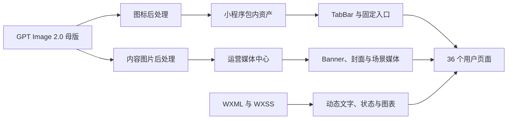

# 小程序 GPT Image 2.0 视觉资产批量生成方案

Feature Name: visual-asset-generation
Updated: 2026-09-07

## 描述

本方案将当前分散的文字图标、Emoji 和无图卡片整理为可复用资产体系。固定入口和品牌资产进入小程序代码包，运营内容图片进入媒体中心，动态数据和交互符号继续由代码绘制。首轮建议生成 106 个母版资产，其中 63 个固定视觉母版、43 个内容与状态母版；同一母版再派生激活态、缩略图和 WebP。

## 资产架构



## 生成清单

### 固定视觉母版：63 个

| 分组 | 数量 | 资产内容 | 主要接入位置 |
| --- | ---: | --- | --- |
| `brand-*` | 5 | 小牛 AI 头像、家长占位头像、男孩、女孩、中性儿童头像 | 首页、聊天、文章作者、我的、孩子档案 |
| `tab-*` | 4 | 首页、功能、成长、我的母版图标 | 原生 TabBar，后处理生成普通态与激活态共 8 个文件 |
| `feature-*` | 8 | 能力观察、今日训练、成长报告、发展专题、家庭支持助手、文章练习、营养支持、家庭场景 | 首页快捷入口 |
| `profile-*` | 9 | 孩子、会员、问答记录、观察记录、周总结、反馈、关于、隐私协议、账号注销 | 我的、孩子档案和账号页 |
| `ability-*` | 12 | 专注、感觉运动、语言、大运动、精细动作、情绪、社交、自信适应、生活习惯、生长健康、安全、认知 | 观察、里程碑、发展专区、知识内容 |
| `scene-*` | 5 | 写作业、吃饭、睡前、出门、一起玩 | 功能页和内容筛选入口 |
| `meal-*` | 5 | 早餐、午餐、晚餐、加餐、汤品 | 营养首页和食谱筛选 |
| `learning-*` | 5 | 阅读理解、逻辑思维、语言表达、学习策略、探究创造 | 每日练习和知识详情 |
| `daily-state-*` | 5 | 情绪、进食、睡眠、活动、社交 | 成长记录 |
| `achievement-*` | 5 | 五级鼓励徽章 | `encouragement-popup` |

### 内容与状态母版：43 个

| 分组 | 数量 | 资产内容 | 主要接入位置 |
| --- | ---: | --- | --- |
| `banner-*` | 3 | 成长观察、家庭支持助手、成长记录 | 首页 Banner，后台动态配置 |
| `recipe-*` | 8 | 小米南瓜粥、豆腐鱼头汤、糯玉米蒸蛋、早餐、正餐、汤品、加餐、通用食谱 | 营养首页、列表、详情和分享 |
| `article-cover-*` | 5 | 情绪、习惯、认知、社交、营养默认封面 | 育儿首页、文章列表、详情相关推荐 |
| `family-scene-*` | 10 | 写作业、吃饭、睡前、洗漱、出门、亲子阅读、收拾玩具、同伴冲突、情绪爆发、运动游戏 | 发展详情、场景详情、训练内容 |
| `empty-*` | 8 | 无孩子、无观察、无成长记录、无食谱、无文章、搜索无结果、无练习、媒体失败 | 全局业务空状态和 `media-gallery` |
| `share-bg-*` | 4 | 观察结果、周总结、通用内容、会员邀请 | 分享预览和各详情分享入口 |
| `membership-*` | 2 | 成长服务 Hero、权益说明 | 会员页 |
| `training-generic-*` | 3 | 开始行动、亲子协作、完成观察 | 训练列表、详情和通用步骤降级 |

## 页面接入矩阵

| 页面 | 应生成并接入 | 保持代码渲染 |
| --- | --- | --- |
| 首页 | 品牌头像、3 Banner、8 功能图标 | 轮播点、标题、CTA、状态卡、箭头 |
| AI 问答 | 小牛头像、无对话插画 | 气泡、录音、发送、加载动画、免责声明 |
| 我的 | 占位头像、9 个菜单图标 | 用户真实头像、状态徽章、箭头 |
| 孩子列表与编辑 | 3 个儿童占位头像、上传图标 | 真实头像、星标、表单、日期选择 |
| 隐私与协议 | 无 | 全部文字排版 |
| 注销与反馈 | 警告图标、反馈空状态 | 表单、复选框、状态徽章 |
| 观察首页 | 12 个能力图标中的相关 10 个 | 年龄、题数、时间和记录数量 |
| 观察答题 | 无 | 进度、题号、单选、前后导航 |
| 观察结果与历史 | 分享背景、无观察或无记录插画 | 分数环、趋势、维度条、筛选 |
| 训练列表与详情 | 3 个通用训练图、内容步骤模板 | 步骤号、反馈选项、安全提示 |
| 营养首页 | 营养 Banner、5 餐次图标、食谱封面 | 年龄筛选、标签、收藏和时间 |
| 食谱列表与详情 | 8 个食谱母版及后续内容图 | 营养条、步骤号、收藏、分享 |
| 育儿首页 | 5 个分类图标、5 个文章封面 | 搜索、筛选、标签、阅读量 |
| 文章列表、详情与搜索 | 分类默认封面、搜索空状态、小牛作者头像 | 富文本、点赞、收藏、评论和筛选 |
| 里程碑及结果 | 能力图标、里程碑封面、无记录插画 | 进度条、百分比、结果状态 |
| 功能页 | 5 个家庭场景图标、能力图标 | 筛选、痛点标签和箭头 |
| 发展详情与场景 | 10 个家庭场景图、后续步骤图模板 | 年龄、步骤、话术、边界提示 |
| 每日练习 | 5 个学习图标、5 类内容封面 | 录音、播放、进度和对话气泡 |
| 知识列表与详情 | 学习图标、按内容生成教学示意图 | 掌握状态、问解练、步骤和骨架 |
| 成长记录与历史 | 5 个每日状态图标、无记录插画 | 日期、选项、输入框和历史列表 |
| 周总结与历史 | 周总结分享背景、无记录插画 | 徽章、趋势、维度条和动态内容 |
| 分享预览 | 4 类分享背景 | 孩子名称、数据、日期、标题和 CTA |
| 会员 | 2 张会员插画、会员邀请分享背景 | 套餐、价格、权益和支付状态 |

## 尺寸与格式

| 类型 | 母版尺寸 | 比例 | 交付要求 |
| --- | ---: | ---: | --- |
| 功能图标 | 1024×1024 | 1:1 | 透明背景，主体占画布 68% 至 74%，派生 192 和 96 像素 |
| 头像 | 1024×1024 | 1:1 | 圆形裁切安全，面部和角完整 |
| 首页 Banner | 1536×584 | 2.63:1 | 主体靠右，左侧保留 44% 低细节文字区 |
| 内容封面 | 1536×960 | 8:5 | 主体居中偏右，兼容列表缩略图 |
| 食谱与场景图 | 1536×1024 | 3:2 | 主体位于中央 70% 方形安全区 |
| 空状态 | 1024×640 | 8:5 | 主体居中，背景透明或 `#FAF8F5` |
| 分享背景 | 1080×1440 | 3:4 | 四周 96 像素安全区，中部保留动态文字区 |
| 会员 Hero | 1536×768 | 2:1 | 右侧主体，左侧文字区 |

包内固定图标使用 PNG；远程媒体优先使用 WebP，并保留 JPEG 兼容导出。图标单文件目标小于 40 KB，头像小于 100 KB，Banner 小于 300 KB，内容图小于 350 KB，分享背景小于 500 KB。

## GPT Image 2.0 Prompt 骨架

### 图标

```text
Create one isolated app icon for a Chinese parenting mini program: {subject}. Warm modern editorial illustration, rounded geometric shapes, friendly and calm, clear silhouette at 24px, sage green #6AAE98 and deep green #397A68 with one restrained accent from {accent}, consistent 2.5D flat style, soft matte texture, centered subject occupying 72 percent of canvas, transparent background, no frame, no shadow outside subject, no text, no letters, no numbers, no watermark, no emoji, no photorealism. Square 1:1.
```

### Banner 与内容场景

```text
Create a warm modern editorial illustration for a Chinese parenting service: {scene}. Show a believable Chinese family home and respectful parent-child interaction, calm natural expressions, soft daylight, uncluttered environment, sage green #6AAE98, cream #FAF8F5 and coral #F28C72 accents, rounded shapes, subtle paper texture, premium but approachable. Place the main people and action on the right side and preserve the left 44 percent as a continuous low-detail area for UI text. No text, no letters, no numbers, no logo, no watermark, no medical claims, no exaggerated emotion, no unsafe child behavior. Wide 2.63:1.
```

### 食谱

```text
Create an appetizing realistic editorial food photograph of {dish}, suitable for a Chinese child aged {age_range}. Home-cooked portion, age-appropriate texture, clean light ceramic bowl, warm natural daylight, cream background with subtle sage green accent, ingredients visually truthful, centered composition with square crop safety, no people, no utensils blocking food, no text, no logo, no watermark, no fantasy ingredients. Landscape 3:2.
```

### 统一负面约束

所有批次统一追加：画面内无中文、无英文、无数字、无水印、无二维码、无模型签名、无额外肢体、无畸形手指、无错误餐具、无医疗器械、无夸张哭闹、无危险动作、无欧美家庭默认形象、无霓虹渐变、无高饱和玩具广告感。

## 命名与落位

- 包内资产：`miniprogram/images/generated/{group}/{asset-id}.png`。
- 远程母版：媒体中心按 `{group}/{asset-id}-master.webp` 管理。
- 派生文件：`{asset-id}@192.png`、`{asset-id}@96.png`、`{asset-id}-thumb.webp`、`{asset-id}-share.webp`。
- 每项资产记录 `assetId`、中文用途、Prompt、seed 或 reference ID、母版尺寸、派生尺寸、替代文本和消费者页面。
- TabBar 激活态由同一透明母版重着色为 `#397A68`，普通态重着色为 `#929995`，保证轮廓完全一致。

## 接入策略

1. 先生成 63 个固定视觉母版并完成风格验收，再用同一参考图和 Prompt 骨架生成 43 个内容与状态母版。
2. 包内只接入 TabBar、品牌头像、固定功能图标和默认空状态；高分辨率内容图进入媒体中心。
3. 首页 Banner 使用现有 `/home/banners` 的 `mobile_image_url` 或 `image_url` 字段。
4. 食谱使用现有 `image` 和 `images` 字段，文章使用 `cover`，练习使用 `cover_image`、`image_url` 或 `icon_url`。
5. 发展专区媒体统一写入 `media[].url`，同时保存 `alt` 和 `caption`。
6. 分享页仅使用背景图，所有用户数据由运行时叠加。

## 正确性约束

- 图标母版内不得包含文字，避免模型文字错误和多语言维护成本。
- 用户真实头像与用户上传图片的显示优先级高于占位资产。
- 同一资产 ID 在页面、后台和接口数据中表达同一语义。
- 远程媒体失败时，页面应保留完整文字和主操作。
- 生成图片不得包含诊断、治疗效果或不安全育儿行为暗示。
- 小程序包内图片增量需要纳入主包体积检查。

## 验收策略

- 视觉抽检：每个分组先审 2 张，确认人物、色彩、构图和纹理一致后继续批量生成。
- 图标测试：在 24、32、48 像素下检查轮廓、透明边缘和普通态/激活态一致性。
- 裁切测试：Banner、列表封面、方形缩略图和分享图分别验证主体安全区。
- 页面测试：覆盖 36 个注册页面的有图、无图、加载失败和弱网状态。
- 技术验证：执行 `npm run lint`、`npm test`，并检查微信开发者工具主包体积。
- 真机验证：在 iOS 与 Android 上检查透明边缘、图片清晰度、首屏加载和深浅背景对比。

## 参考

- `.monkeycode/docs/ARCHITECTURE.md`
- `.monkeycode/specs/2026-09-02-miniprogram-experience-refactor/requirements.md`
- `.monkeycode/specs/2026-09-02-miniprogram-experience-refactor/design.md`
- `miniprogram/app.json`
- `miniprogram/pages/index/index.wxml`
- `miniprogram/pages/index/index.js`
