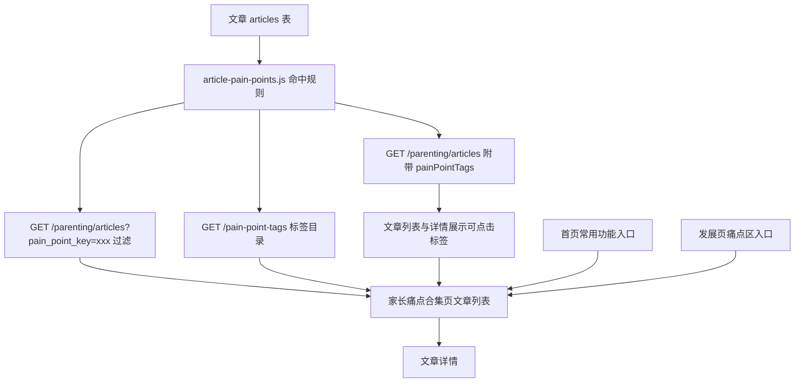

# 家长痛点合集技术设计

Feature Name: parent-pain-point-collection
Updated: 2026-09-14

## Description

在文章与家长痛点之间建立自动关联：后端用固定规则从文章标题、摘要、标签、子分类和分类派生家长痛点标签；文章接口在返回文章时附带标签，并支持按标签筛选；小程序在文章列表、文章详情展示可点击标签，新增合集页按标签分组浏览文章；首页常用功能和发展页痛点区提供入口。

标签不写入数据库，属于查询期派生数据，因此不新增迁移，也不改动后台内容编辑流程。

## Architecture



命中规则的判定条件是若干「关键词命中」与「分类兜底」的析取，因此后端可以把同一份规则同时用于两条路径：给单篇文章计算标签时在 JavaScript 中求值，按标签筛选时把等价条件下推到 SQL。两条路径共用一份定义，保证标签与筛选结果一致。

## Components and Interfaces

### 后端

**`backend/src/mysql-production/article-pain-points.js`（新增）**

- `PAIN_POINT_TAGS`：有序标签定义数组，每项包含 `key`、`label`、`category`、`keywords`、`articleCategories`。
- `listPainPointTags()`：返回用于展示的标签目录，字段为 `key`、`label`、`category`。
- `isPainPointTagKey(key)`：判断标签 key 是否受支持。
- `matchArticlePainPoints(article)`：输入文章行，输出 `0..3` 个 `{ key, label, category }`。
- `buildPainPointFilter(key)`：返回 `{ sql, params }`，`sql` 为与命中规则等价的析取条件。

命中规则：

1. 文章文本由 `title`、`summary`、`content`、`tags`、`sub_category` 拼接。
2. 标签命中条件为「文本包含该标签任一关键词」或「文章 `category` 属于该标签的 `articleCategories`」。
3. 命中标签按 `PAIN_POINT_TAGS` 顺序排列，最多保留 3 个。

标签定义：

| key | label | category | 关键词示例 | 分类兜底 |
| --- | --- | --- | --- | --- |
| `called_no_response` | 叫了几次像没听见 | 做事与学习 | 叫不应、没反应、听不见、不理 | 无 |
| `distracted_during_task` | 做事容易分心 | 做事与学习 | 分心、坐不住、走神、专注、磨蹭 | 无 |
| `cries_when_switching` | 换活动就哭闹 | 情绪与配合 | 哭闹、发脾气、情绪、分离焦虑、顶嘴 | 情绪管理 |
| `unclear_speech` | 说话说不清楚 | 说话与表达 | 说不清、表达、语言、复述、词汇 | 无 |
| `cannot_play_together` | 不会和同伴相处 | 同伴与相处 | 同伴、冲突、抢、分享、一起玩 | 社交能力 |
| `sleep_resistance` | 睡前不肯睡 | 身体与适应 | 睡前、入睡、睡眠、作息、洗漱 | 无 |
| `picky_eating` | 吃饭挑食磨蹭 | 身体与适应 | 挑食、吃饭、食欲、偏食、早餐 | 营养健康 |
| `body_adaptation` | 运动与安全 | 身体与适应 | 运动、体能、户外、换季、身体不适、摔倒、磕碰、受伤 | 无 |

分类兜底只保留与痛点近乎同义、实测漂移极低的分类（情绪管理、社交能力、营养健康）。宽泛分类（如行为习惯、认知发展）会引入大量无关文章，因此这些标签只做关键词匹配。多义词也不作为关键词：`叫他`/`喊他`/`不理` 会命中书籍章节，`适应`/`健康`/`安全` 会命中「入园适应」「认知健康」「安全感」。用生产全量 2800 篇文章做回归，收紧后各标签的分类兜底漂移从 96%/54%/26%/22% 降到 ≤1.7%。

**`backend/src/mysql-production/server.js`（修改）**

- 注册 `GET ${prefix}/pain-point-tags`，使用 `optionalAuthenticateToken`，返回 `{ list }`。
- `parentingArticlesHandler` 接受 `pain_point_key`：不受支持时返回 `400`；受支持时把 `buildPainPointFilter` 的条件并入 `whereClause`。
- `normalizeArticle` 增加 `painPointTags: matchArticlePainPoints(row)`。
- `buildParentingArticlesCacheKey` 纳入 `pain_point_key`，避免不同标签命中同一缓存。

### 小程序

**`miniprogram/pages/parenting/pain-point-collection/`（新增页面）**

- `index.js`：加载标签目录，维护 `activeTagKey`、`articles`、`page`、`hasMore`、`loading`、`loadError`。
- 首次进入读取 `painPointKey` 查询参数，合法时直接选中该标签。
- 切换标签时重置分页并请求第一页；上拉触底请求下一页。
- `onPullDownRefresh` 重新加载目录与当前标签文章。
- 点击文章跳转文章详情。合集页用 `wx.navigateTo` 叠加在进入前的页面上，返回时由页面栈回到原页面。
- 合集页标签 key 属于后端文章派生标签，与本地成长痛点目录 key 不同，因此不提供跳转成长痛点详情的入口，避免断链。

**`miniprogram/pages/parenting/article-list/`、`article-detail/`（修改）**

- 渲染 `article.painPointTags`，点击时跳转合集页并带上 `painPointKey`。
- 无标签时隐藏标签区域。

**`miniprogram/pages/index/index.js`、`index.wxml`（修改）**

- 在「常用功能」标题下新增一个通栏入口卡片，点击进入合集页。
- 通栏卡片使用文本加箭头表达，不依赖新增图片资源，避免打乱现有 4 列功能网格。

**`miniprogram/pages/development/index/index.js`、`index.wxml`（修改）**

- 在痛点区底部新增「查看家长痛点合集」入口。

**`miniprogram/app.json`（修改）**

- 注册 `pages/parenting/pain-point-collection/index`。

**`miniprogram/utils/app-config.js`（修改）**

- 增加 `painPointCollectionEnabled`，读取 `pain_point_collection_enabled`，缺省时回退到 `envConfig.enablePainPointCollection`，再回退到 `miniprogram_remote_content_enabled`。
- 后端 `runtimeConfigHandler` 输出 `pain_point_collection_enabled`，来源是环境变量 `RUNTIME_PAIN_POINT_COLLECTION_ENABLED`，未配置时跟随 `RUNTIME_MINIPROGRAM_REMOTE_CONTENT_ENABLED`。运维可以单独下线合集而不关闭其他远程内容。

## Data Models

不新增数据库表和字段。文章公开载荷新增：

```json
{
  "id": 101,
  "title": "4-5岁孩子情绪表达的4个引导技巧",
  "category": "情绪管理",
  "painPointTags": [
    { "key": "cries_when_switching", "label": "换活动就哭闹", "category": "情绪与配合" }
  ]
}
```

标签目录接口响应：

```json
{
  "success": true,
  "data": {
    "list": [
      { "key": "called_no_response", "label": "叫了几次像没听见", "category": "做事与学习" }
    ]
  }
}
```

合集页文章列表复用 `GET /parenting/articles` 的分页结构：`list`、`pagination.page`、`pagination.page_size`、`pagination.total`、`pagination.has_more`。

## Correctness Properties

1. **确定性**：同一篇文章字段不变时，`matchArticlePainPoints` 始终返回相同标签序列。
2. **筛选等价**：`buildPainPointFilter(key)` 与 `buildPainPointExclusion()` 组合出的 SQL 条件与 `matchArticlePainPoints` 对同一 key 的判定完全等价，等价性由「关键词析取 + 分类析取」与「标题排除」结构共同保证，排除条件在 JS 与 SQL 两侧复用同一个模式串。
3. **目录一致**：文章载荷中的标签与 `/pain-point-tags` 来自同一份 `PAIN_POINT_TAGS`，`key`、`label`、`category` 不产生分叉。
4. **排序与上限**：标签按目录顺序排列，数量不超过 3；文章分类已知时至少 1 个。
5. **分页正确**：`total` 与 `has_more` 基于同一过滤条件计算，翻页不重复、不遗漏。
6. **key 稳定**：`key` 作为筛选标识保持稳定，`label` 与 `category` 可单独调整而不影响历史筛选。

## Known Limitations

- 生产文章语料包含书籍章节与拆条内容（分类如 `认知健康`、`情绪养育`、`家庭教育`，标题形如「第X章 …」「第N步 …」「…（片段N）」「… - …」「65 摇晃宝宝」）。已对匹配 `片段|第[0-9]+步|第[0-9一二三四五六七八九十百]+章| - |^[0-9]+\s` 的标题，以及 `EXCLUDED_CATEGORIES`（`家庭教育`，整批导入且经核对不含正式手写内容）做排除（`isPainPointEligible` + `buildPainPointExclusion`）。序号只匹配阿拉伯数字，前导序号要求数字后跟空白，「第一步」「迈出社交第一步」「3岁孩子…」这类正常标题保持可用；` - ` 与前导序号两类形态在生产 2800 篇里对全部正式分类零命中。
- 残余范围：`认知发展`、`心理发展`、`运动发展` 等分类里还有少量书籍改写内容（如「小脑不只是运动中枢：它也是注意力和思维的关键」「运动对女性大脑健康的特殊价值」），标题不含上述任何形态。整类排除 `认知发展` 会同时去掉该分类下大量正式手写内容（约 58 篇），因此保留，需内容侧治理。
- 文章基表与搜索接口仍会展示全部 `is_published=1` 的导入书稿（本轮排除只作用于痛点标签与合集，未改内容发布状态）；生产 2800 篇里导入书稿约 1600 篇，属独立的内容治理议题。
- `called_no_response` 的关键词在生产语料里只命中书籍内容，排除后收录为 0，合集内呈现空状态；尝试补 `叫他`/`喊他`/`不理` 等词只会引入无关文章，故未采用。这反映内容供给缺口，不是标签规则缺陷。
- 文章筛选基于 `articles` 基表行，展示标签基于 `resolvePublishedArticle` 合并已发布版本后的文本。已发布内容被后台改动后，两者可能分叉；当前语料未观察到该情况。
- 单篇文章最多展示 3 个标签，而筛选不截断，因此排在目录末位的标签（如 `body_adaptation`）可能出现在合集里但卡片不显示该标签。

## Error Handling

| 场景 | 处理 |
| --- | --- |
| `pain_point_key` 不受支持 | 文章接口返回 `400` 与「pain_point_key参数无效」 |
| 标签目录接口失败 | 合集页展示错误状态与重新加载按钮 |
| 文章列表接口失败 | 保留当前标签选择，展示重试提示与轻提示 |
| 标签下没有文章 | 展示空状态，保留下拉刷新 |
| 文章没有痛点标签 | 文章列表与详情隐藏标签区域 |
| 功能开关关闭 | 首页与发展页隐藏入口，合集页直接访问时展示功能未开放提示 |

## Test Strategy

**单元测试**

- 新增 `scripts/test-article-pain-point-tags.js`：验证关键词命中、分类兜底、排序、3 个上限、key 稳定性，以及 `buildPainPointFilter` 与 `matchArticlePainPoints` 的等价性（对样例文章逐条比对 SQL 条件命中结果）。

**页面行为测试**

- 新增 `scripts/test-pain-point-collection-page.js`：使用 `vm` 加载页面脚本，验证首次加载选中第一项、带 `painPointKey` 进入时选中指定项、切换标签重置分页、触底加载下一页、空状态与失败重试。

**结构与契约测试**

- 扩展 `scripts/test-miniprogram-core-ui-structure.js`：断言首页通栏入口、发展页入口、文章详情标签节点、合集页已在 `app.json` 注册。
- 扩展 `scripts/test-detail-primary-navigation.js`：断言文章标签跳转合集页并携带 `painPointKey`，合集页返回回到进入前页面。

**回归与门禁**

- `npm run lint`、`node scripts/test-miniprogram-page-states.js` 全量通过。
- 公网只读验证：`GET /api/v1/pain-point-tags` 返回目录；`GET /api/v1/parenting/articles?pain_point_key=xxx` 返回过滤结果且 `pagination` 正确。

## References

[^1]: (File) - [文章接口与 normalizeArticle](/workspace/backend/src/mysql-production/server.js)
[^2]: (File) - [痛点契约定义](/workspace/backend/src/mysql-production/platform-contract.js)
[^3]: (File) - [文章分类与年龄字典](/workspace/.monkeycode/docs/business-dimensions.md)
[^4]: (File) - [小程序痛点工具](/workspace/miniprogram/utils/pain-points.js)
[^5]: (File) - [文章列表页](/workspace/miniprogram/pages/parenting/article-list/article-list.js)
[^6]: (File) - [文章详情页](/workspace/miniprogram/pages/parenting/article-detail/article-detail.js)
[^7]: (File) - [发展页痛点区](/workspace/miniprogram/pages/development/index/index.wxml)
[^8]: (File) - [需求文档](/workspace/.monkeycode/specs/2026-09-14-parent-pain-point-collection/requirements.md)
